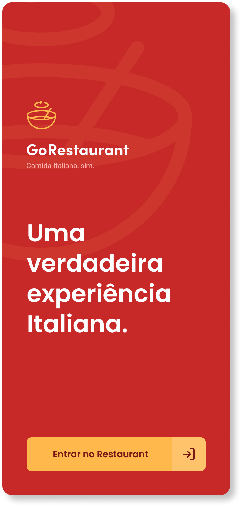
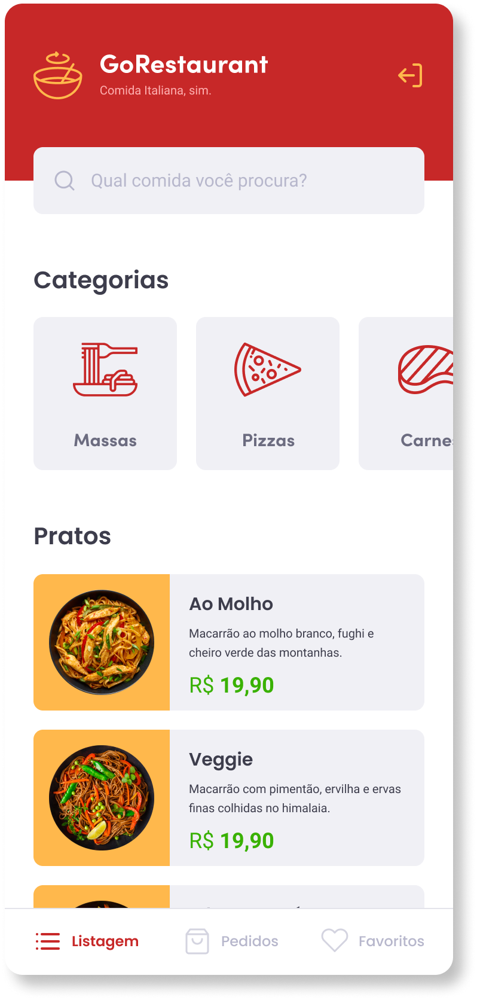

 <p align="center">
    
  </p>


  <p align="center">
    
    
  </p>

<h3 align="center">
  Foi desenvolvido o front-end mobile de uma aplicação de um restaurante, a GoRestaurant, utilizando uma fake API, criada usando o JSON Server, só que dessa vez a versão mobile para utilização pelos clientes.
</h3>

<p align="center">
  

  

  
</p>

<p align="center">
  <a href="#funcionalidades">Funcionalidades</a>&nbsp;&nbsp;&nbsp;|&nbsp;&nbsp;&nbsp;
  <a href="#heavy_check_mark-configurações-necessárias">Configurações necessárias</a>&nbsp;&nbsp;&nbsp;|&nbsp;&nbsp;&nbsp;
  <a href="#arrow_down_small-clonando-o-repositório">Clonando o repositório</a>&nbsp;&nbsp;&nbsp;|&nbsp;&nbsp;&nbsp;
  <a href="#beginner-iniciando-a-aplicação">Iniciando a aplicação</a>&nbsp;&nbsp;&nbsp;|&nbsp;&nbsp;&nbsp;
  <a href="#wrench-tecnologias--ferramentas--recursos">Tecnologias | Ferramentas | Recursos</a>&nbsp;&nbsp;&nbsp;|&nbsp;&nbsp;&nbsp;
  <a href="#memo-license">Licença</a>
</p>

Durante as aulas do [RocketSeat GoStack Bootcamp](https://rocketseat.com.br/bootcamp) foram aprendidos conteúdos relacionados a React Native junto com TypeScript, que foram utilizados nesse projeto para criar um pequeno app para pedidos de comida.

### Funcionalidades

- Listar os pratos de comida da API;
- Listar as categorias da API;
- Filtrar pratos de comida por busca ou por categorias;
- Listar os pedidos da API;
- Listar os pratos favoritos da sua API;
- Realizar um pedido;
- Adicionar ou reduzir quantidade do prato selecionado no pedido;
- Adicionar ou reduzir quantidade de itens extras no pedido.

### :heavy_check_mark: Configurações necessárias

Seguem as configurações neessárias para visualizar a aplicação em sua máquina.

-  [Git](https://git-scm.com);
-  [Node](https://nodejs.org/);
-  [Yarn](https://yarnpkg.com/);
-  Ambiente para desenvolvimento mobile configurado conforme sistema operacional utilizado.

### :arrow_down_small: Clonando o repositório
1. Pelo terminal, acesse o diretório em que deseja ter o repositório clonado e execute o comando a seguir.
```bash
# clonando o repositório
git clone https://github.com/belapferreira/go-restaurant-mobile
```

### :beginner: Iniciando a aplicação
1. Inicialize o emulador ou conecte o dispositivo físico e verifique a disponibilidade em uma janela do terminal.
```bash
# verificando dispositivos disponíveis
adb devices
```
2. Pelo terminal, acesse a pasta do repositório clonado e execute os comandos abaixo.
```bash
# instalando as dependências
yarn install

# iniciando a API fictícia
yarn json-server server.json -p 3333

# instalando a aplicação no dispositivo
react-native run-android

# iniciando a aplicação
react-native start

# carregando a aplicação
digite r no terminal || cmd + r e reload || ctrl + m e reload
```
### :mag: Realizando os testes
1. Foi usado um template que contém testes para orientar o que esperava-se dos blocos de códigos a serem programados;
2. Para verificar se qualquer alteração realizada atende aos requisitos solicitados, acesse o terminal e execute o seguinte comando:
```bash
# testando atendimento aos requisitos
yarn test
```

### :wrench: Tecnologias | Ferramentas | Recursos

Esse projeto foi desenvolvido utilizando os seguintes recursos:

-  [Axios](https://github.com/axios/axios);
-  [Axios Mock Adapter](https://github.com/ctimmerm/axios-mock-adapter);
-  [Editor Config](https://editorconfig.org/);
-  [Eslint](https://eslint.org/);
-  [Intl](https://github.com/andyearnshaw/Intl.js/);
-  [Jest](https://jestjs.io/);
-  [Json Server](https://github.com/typicode/json-server);
-  [Prettier](https://prettier.io/);
-  [React](https://pt-br.reactjs.org/);
-  [React Navigation](https://reactnavigation.org/);
-  [React Native](https://reactnative.dev/);
-  [Styled Components](https://styled-components.com/);
-  [Supertest](https://github.com/visionmedia/supertest);
-  [TypeScript](https://www.typescriptlang.org/).

### :memo: License
Esse projeto está sob MIT license. Veja [LICENSE](https://github.com/belapferreira/go-restaurant-mobile/blob/master/LICENSE) para mais informações.

---

Feito por Bela Ferreira :blue_heart: Contato: https://www.linkedin.com/in/belapferreira :blush:
